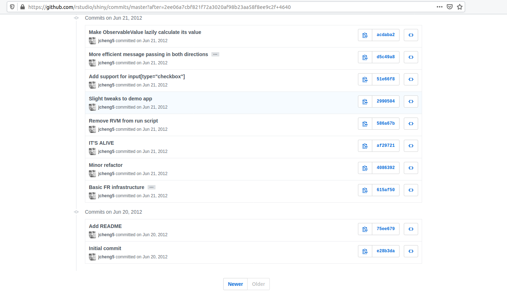
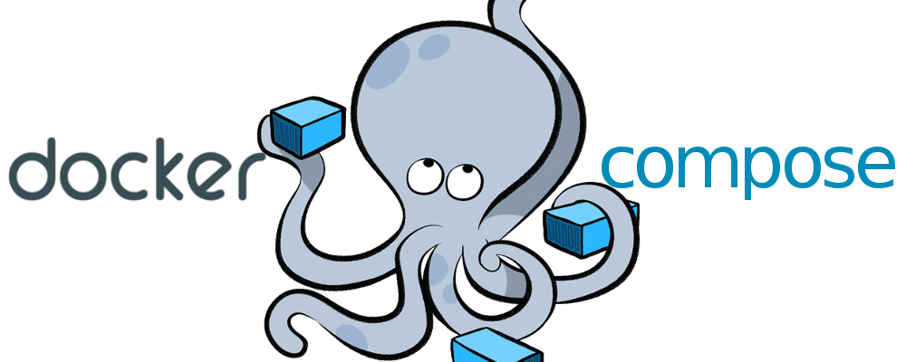
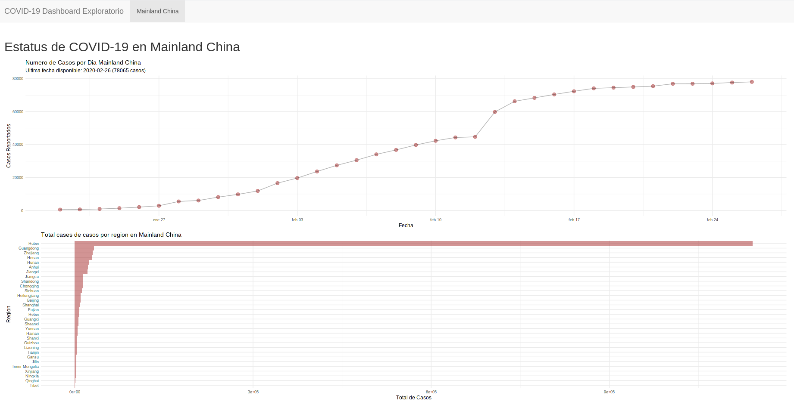
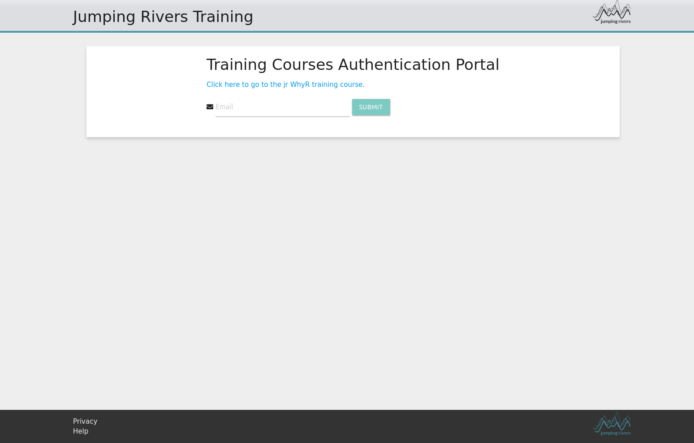
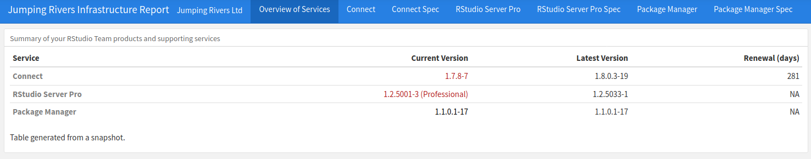

# Outline

- Shiny
- Paquetes en R
- Golem
- Demos
- Jumping Rivers

---

class: inverse, middle, center

# *Shiny*

```{r, echo =FALSE}
knitr::opts_chunk$set(echo = T, eval = F, warning = F, message = F)
```

---

## Orígenes de Shiny


---

## Orígenes de Shiny



---

## Módulos

- Componentes individuales para desarrollar una aplicación

<iframe width="560" height="315" src="https://www.youtube.com/embed/Hq0bcy4DCDg" frameborder="0" allow="accelerometer; autoplay; encrypted-media; gyroscope; picture-in-picture" allowfullscreen></iframe>

---

## Módulos

- Interfaz de Usuario

```{r}
plotExportUI <- function(id) {
  ns <- NS(id)   
  tagList(
    selectInput(ns("type"),
                label = "Type",
                choices = c("png", "pdf")),
    plotOutput(ns("preview")),     
    downloadButton(ns("download"), "Download")   
  )
}
```

[Fuente: https://www.r-bloggers.com/shiny-modules/](https://www.r-bloggers.com/shiny-modules/)
---

## Módulos

- Servidor

```{r}
plotExport <- function(input, output, session, plotObj) {
  output$preview <- renderPlot({
    plotObj()   
  })   
  output$download <- downloadHandler(
    filename = function(){paste0("plot.", input$type)},     
    content = function(file){
      switch(         
        input$type,         
        png = png(file),         
        pdf = pdf(file))         
      print(plotObj())       
      dev.off()}   
    )}
```

[Fuente: https://www.r-bloggers.com/shiny-modules/](https://www.r-bloggers.com/shiny-modules/)

---
## Publicación de la aplicación

- Manejo de dependencias
- Trabajando colaborativamente
- Diferentes plataformas de publicación
    - RStudio Connect
    - Docker
    
.pull-left[]
.pull-right[]
    
---
class: inverse, middle, center

# *Paquetes en R*

---

## ¿Qué es un paquete en R?

- Un paquete en R es un conjunto de objetos, su documentación y todo código or artificio necesario para poder utilizar los objetos del mismo.

- Estados de un paquete
    - Código Fuente
    - Empaquetado
    - Binario
    - Instalado
    - En-Memoria

---

## ¿Por qué utilizar los paquetes en R?

.pull-left[
- Reproducibilidad
- Documentación
    - ROxygen2
- Reusabilidad
    - GitHub/GitLab
    - CRAN
- Dependencias
]

.pull-right[

]
---

## Estructura de un paquete en R

- Código (R/)
- Metadata del paquete (DESCRIPTION)
- Documentación de los objetos (man/)
- Pruebas (tests/)
- Namespace (NAMESPACE)

---

## Publicando paquetes en R

- CRAN


- GitHub & GitLab

.pull-left[]
.pull-right[]

---
class: inverse, middle, center

# *Golem*

---

## Introducción a Golem

.pull-left[
- Es un framework opinionado para producir aplicaciones Shiny de nivel de producción
- Aplicación de Shiny como un paquete de R
- Utiliza los módulos
]
.pull-right[]

---

## `01_start.R`

- `fill_desc()`

```{r}
golem::fill_desc(
  pkg_name = "PKG_NAME",
  pkg_title = "PKG_TITLE",
  pkg_description = "PKG_DESC.",
  author_first_name = "AUTHOR_FIRST",
  author_last_name = "AUTHOR_LAST",
  author_email = "AUTHOR@MAIL.COM",
  repo_url = NULL
)    
```

---
## `01_start.R`

- `set_golem_options()`

```{r}
golem::set_golem_options()
```

Esto especificará:
- Nombre del paquete
- Versión del paquete
- Working Directory del paquete
- Si el app esta en modo de producción o no

---
## `01_start.R`

### Archivos de utilidad

##### Licencia

```{r}
usethis::use_mit_license( name = "Golem User" )
```

##### `README.Rmd`

```{r}
usethis::use_readme_rmd( open = FALSE )
```

##### Código de Conducta

```{r}
usethis::use_code_of_conduct()
```

---
## `01_start.R`

### Archivos de utilidad

##### Badge de madurez del paquete

```{r}
usethis::use_lifecycle_badge( "Experimental" )
```

##### Noticias

```{r}
usethis::use_news_md( open = FALSE )
```

##### Git

```{r}
usethis::use_git()
```

---
## `01_start.R`

### Pruebas

```{r}
golem::use_recommended_tests()
```

### Dependencias recomendadas

```{r}
golem::use_recommended_deps("")
```

[`shiny`, `DT`, `attempt`, `glue`, `htmltools`, `golem` ]

### Archivos de Utilidades

```{r}
golem::use_utils_ui()
golem::use_utils_server()
```

---

## `02_dev.R`

### Añadiendo módulos

```{r}
golem::add_module( name = "mi_primer_modulo" )
```

```r
# mod_UI
mod_my_first_module_ui <- function(id){
  ns <- NS(id)
  tagList(
 
  )
}

mod_my_first_module_server <- function(input, output, session){
  ns <- session$ns
}
    
## To be copied in the UI
# mod_my_first_module_ui("my_first_module_1")
    
## To be copied in the server
# callModule(mod_my_first_module_server, "my_first_module_1")
```
---

## `02_dev.R`

### Añadiendo dependencias

```{r}
usethis::use_package("paquete")
```

### Añadiendo más pruebas

```{r}
usethis::use_test( "app_test" )
```

### Añadiendo archivos externos

```{r}
golem::add_js_file("script")
golem::add_js_handler("script")
golem::add_css_file("custom")
```

---

## `02_dev.R`

###  Integración Continua y Cobertura de Código

```{r}
usethis::use_travis()
usethis::use_appveyor()
usethis::use_coverage()
```


---

## `03_deploy.R`

- `run_app()`

```{r}
run_app <- function(...) {
  with_golem_options(
    app = shinyApp(ui = app_ui(), server = app_server),
    golem_opts = list(...)
  )
}
```


---

## `03_deploy.R`

### Plataformas listas para publicación

- RStudio Connect

```{r}
golem::add_rstudioconnect_file()
```

- ShinyApps.io

```{r}
golem::add_shinyappsio_file()
```

- Shiny Server Pro

```{r}
golem::add_shinyserver_file()
```

---
## `03_deploy.R`

### Plataformas para publicación independiente


```{r}
golem::add_dockerfile()
```

Otras opciones son: `ShinyProxy Dockerfile` y `Heroku Dockerfile`

---

## Comentarios sobre Deployment con Docker

.pull-left[
#### Nginx


]

.pull-right[
#### Docker Compose


]
 
---
class: inverse, middle, center

# *Demos*
---

## COVID-19


[Fuente: https://www.elsaltodiario.com/racismo/xenofobia-america-latina-expande-mas-rapido-coronavirus](https://www.elsaltodiario.com/racismo/xenofobia-america-latina-expande-mas-rapido-coronavirus)
---

## COVID-19



---
class: inverse, middle, center

## COVID-19

## Vamos a verlo en RStudio!

---

## Password App Assigner



---
class: inverse, middle, center

# Jumping Rivers

---

## ¿Por qué usamos Golem en Jumping Rivers?

- Estandarización del desarrollo de aplicaciones Shiny
- Monitoreo de diferentes servicios



---
class: inverse, middle, center

# Preguntas

- Twitter: `@iflores_siaca`
- GitHub: `@ian-flores`
- Email: `iflores.siaca@protonmail.ch`
